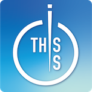
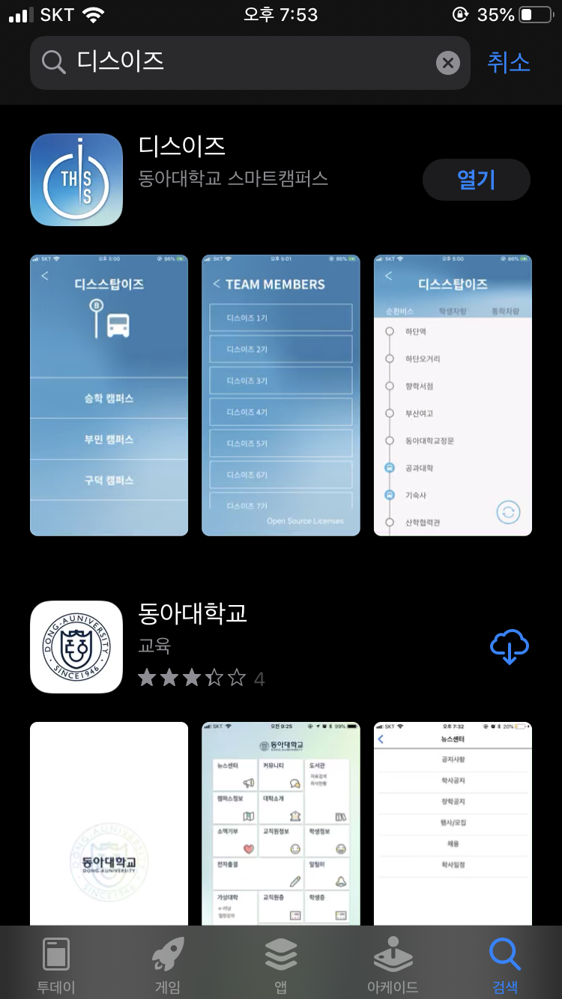
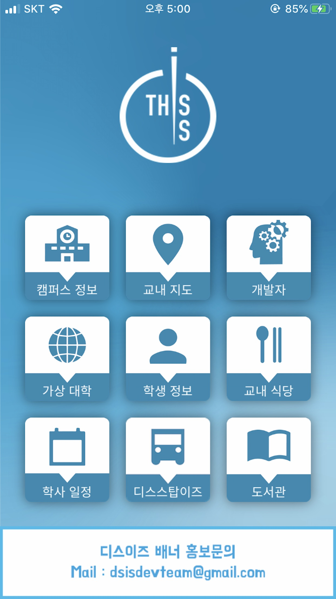
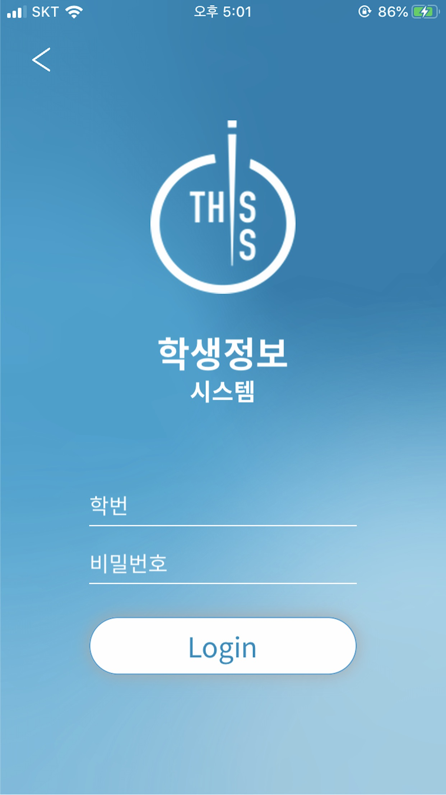
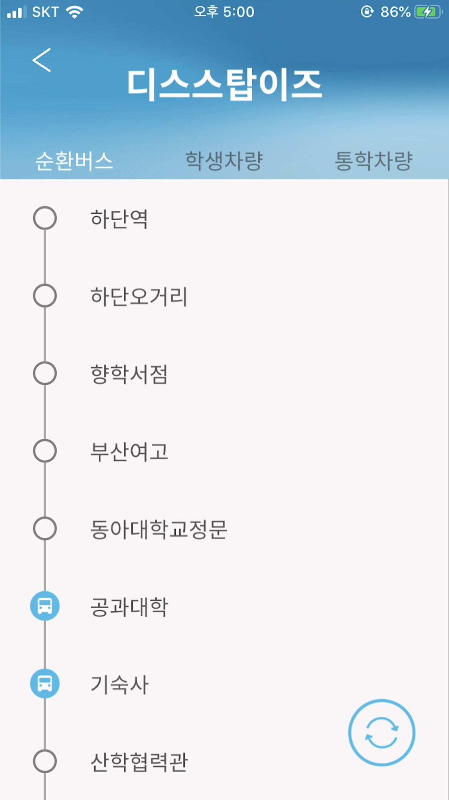
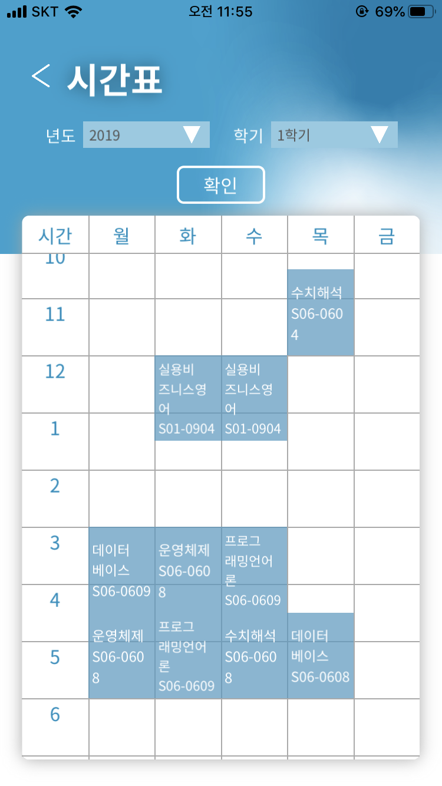

<h1>
 디스이즈 - 동아대학교 스마트 캠퍼스 애플리케이션
</h1>

## API

### [Alamofire](https://github.com/Alamofire/Alamofire)

- JSON 으로 서버로 부터 정보를 받아올 때 사용
- 서버에서 이미지 파일의 data를 받아올 때 사용

~~~swift
Alamofire.request(URL).responseJSON{(response in 
	guard let data = response.data else { return }
	do{
		let info = try JSONDecoder().decode(Info.self, from: data)
	} catch let error{
		print("ERROR = \(error)")
	}
)}

let parameters: [String : Any] = [
  "year": "\(self.year)"
]
Alamofire.request(URL,method: .post, parameters: parameters).responseString { response in }

Alamofire.request(URL).responseData(completionHandler: {(data) in
	guard let data = data.data else { return }
	DispatchQueue.main.async{
    self.imageView.image = UIImage(data: data)
  }
})

~~~

### [Kanna](https://github.com/tid-kijyun/Kanna)

- Alamofire로 HTML을 받아와서 XPath로 접근 할때 사용

~~~swift
if let doc = try? Kanna.HTML(html: html, encoding: String.Encoding.utf8){
	let nameTag: String = doc.xpath("//*[@id=' ']")[0].text ?? ""
}
~~~

### [Reachability](https://github.com/ashleymills/Reachability.swift)

- 데이터, Wifi 연결확인

~~~swift
private func reachabilityCheck(){ //네트워크 확인
  //네트워크 확인 - wifi인지, 데이터 사용인지, 아무것도 안킨 상태인지
  NotificationCenter.default.addObserver(self, selector: #selector(reachabilityChanged(note:)), name: .reachabilityChanged, object: reachability)
  do{
    print("노티실행")
    try reachability.startNotifier()
  }catch{
    print("could not start reachability notifier")
  }
}
//네트워크 확인 오픈소스
@objc func reachabilityChanged(note: Notification) { 
  let reachability = note.object as! Reachability
  switch reachability.connection {
    case .wifi:
    	print("Reachable via WiFi")
    	self.versionCheck() //버전 확인
    case .cellular:
    	print("Reachable via Cellular")
    	self.versionCheck() //버전 확인
    case .unavailable:
    	print("Network not reachable")
	    //기본 AlertView
  	  let AlertView = UIAlertController(title: "알림", message: "인터넷 연결상태가 좋지 않습니다.\n확인 후 다시 이용해주세요.", preferredStyle: UIAlertController.Style.alert)
  	  let OK = UIAlertAction(title: "확인", style: UIAlertAction.Style.default) { (_: UIAlertAction) -> Void in
				print("확인")
				self.reachabilityChanged(note: note)
			}
    	AlertView.addAction(OK)
    	self.present(AlertView, animated: true, completion: nil)
    default :
    	break
  }
}
~~~

## Timetable

2017.03 ~ 2018.12 프로토타입 개발

2019.03 ~ 2020.01 프로젝트 진행

2020.01 최종 테스트 진행

2020.02.05 App Store 출시

2021.01.22 App Store 판매중단 

## Screen Shots
  

 
